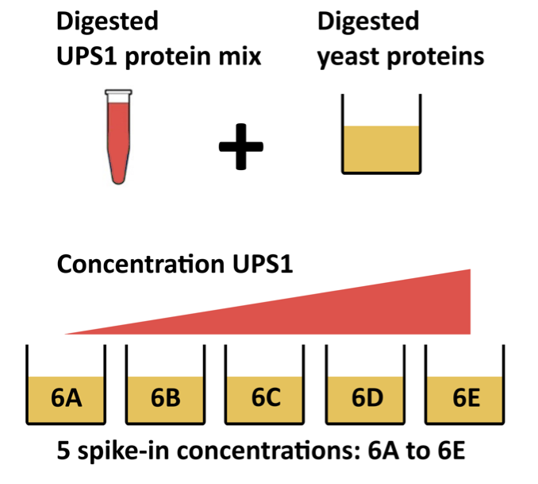

# Background

## Christian de Duve (1917 - 2013)

- Belgian Nobel price winner 
- Pioneer in biochemistry and biotechnology
- Amazing definition of life: 

1. Life is one. All composed of cells (we, animals, plants, ). Same building blocks (sugars, lipids, proteins, amino acids). Metabolically connected, share same metabolic memory of 3.8 billion years as all these cells divided uninterrupted from their last universal common ancestor. And as scientific rebel Lynn Margulis would state it more complex multicellular organisms such as fungi, plants and animals can be seen as a massive colony of differentiated, fusing and mutating symbiotic microorganisms.

2. Life is chemistry. If we say metabollically connected, we get to chemistry. It is this unqie chemical network of reactions that gives our cells and life their unique properties to adapt and interact with their changing environment, to remain in homeostasis or to sometimes change to another attracter, e.g. fruiting body

3. Life is information; Get to the third point of , which is pivotal for our work. No chemical necessity of order of DNA code, e.g. Goldman et al, Birney's group 2013 stored all shakespeare's sonnets, 26 second clip of I have a dream, pdf of Watson and Crick's paper on structure of DNA, ... https://doi.org/10.1038/nature11875


## Why proteomics? 

While genes provide the blueprint, 
proteins are the active functional molecules of life, 

 - driving cellular processes, 
 - signaling, 
 - structure, 
 - disease mechanisms, 
 - etc.

--> 3 D structure! Changes due to PTM, key switches! 

```{r echo=FALSE}
#| layout-ncol: 2
knitr::include_graphics(c("./figs/Dogma_Euk.png","./figs/cellProteins.png"))
```


## Conventional MS-based workflow

```{r, echo = FALSE, out.width = "60%", fig.cap = "Overview of an LFQ-based proteomics workflow."}
knitr::include_graphics("figs/lfq_workflow.png")
```
  
- piptetting variability, extraction --> normalisation
- LC --> batch effects, e.g. single cell exp
- ionisation efficiencies, charge --> how fly through MS
- MS1 quant, But unknown what species , MS2 fingerprint compare to theoretical spectra or known spectra (spectral lib search).
- Errors in ID, missingness, ....


- Peptide Characteristics
  
  - Modifications
  - Ionisation Efficiency: huge variability
  - Identification
    - Misidentification $\rightarrow$ outliers
    - MS$^2$ selection on peptide abundance
    - Context depending missingness
    - Non-random missingness

$\rightarrow$ Unbalanced pepide identifications across samples and messy data

## Data Dependent Acquisition 

- m/z range into sequential windows (e.g., 400–425, 425–450 m/z) 
- MS2 spectra are complex as many peptides mixed
- Deconvolution of the MS2 signal 
- With dedicated software such as Spectronaut or DIA-NN

    - Identification based on spectral libraries
    - Library free: FASTA database to predict in silico spectra, retention times, and ion mobilities, which are then used to search the DIA data
    - Use of decoys sequences to estimate false discovery rate of ID 
    
- Quantification using MS2 and/or MS1 peaks

## Level of quantification

- MS-based proteomics returns peptides or precursors: pieces of proteins

```{r echo=FALSE}
knitr::include_graphics("./figs/challenges_peptides.png")
```

- Quantification commonly required on the protein level

```{r echo=FALSE}
knitr::include_graphics("./figs/challenges_proteins.png")
```

summarisation or aggregation either in model for inference or in data processing. 

## DIA workflow

DIA-NN provides multiple quantifications, e.g. derived from the MS1 or MS2 spectra, and at precursor or protein (protein group) level. The term 'precursor' refers to a charged peptide species and is the basic unit of identification and quantification in DIA. Hence, in the context of DIA we refer to a precursor table, instead of to a PSM table in DDA. 

Examples of different quantities are:

- raw MS1 area: Ms1.Area, normalised MS1 Area: Ms1.Normalised, MS2 Precursor quantities: Precursor.Quantity, Normalised MS2 Precursor quantities: Precursor.Normalised, etc., which are all at the precursor level 
- MS2 based summary at the protein (protein group)-level: PG.MaxLFQ

Here, we will use the `Precursor.Quantity` column.

## Experimental context 

This chapter explains how to analyse a proteomics data set that has 
been generated using data independent acquisition (DIA). We will again
use an in-house spike-in study to illustrate the analysis.
The DIA case-study is a subset of Staes et al. [@Staes2024]. They spiked digested UPS proteins in yeast at the following ratio's (yeast:ups ratio 10:1, 10:2, 10:4, 10:8, 10:10) in a yeast digest background.

Each sample was analyzed in triplicate using an
Ultimate 3000 RSLC ProFlow nano-LC system in-line
connected to a Q Exactive HF BioPharma mass spectrometer
(Thermo). 

Here, we will only use the data of the samples from the middle 3 spike-in ratio's (2,4 and 8) that were searched using DIA-NN 2.2.0. The main search output for this DIA-NN version is stored in the report.parquet file in the DIA-NN output directory.


```{r echo=FALSE, out.width="50%"}

```


# Load packages

## Parallelisation {#sec-parallel}

# Data

## Precursor table

We load the output from DIA-NN parquet file.

```{r import_data}
precursorFile <- "data/spikein248-staesetal2024.parquet" 
```


We can import the report.parquet file using the `read_parquet` function from the `arrow` package. 
Note, that older versions of DIA-NN store the output as report.tsv. 

```{r}
precursors <- arrow::read_parquet(precursorFile) # function from the arrow package
#precursors <- data.table::fread(precursorFile) # For older versions of DIA-NN, where the results are stored as tsv files. Note that the precursorFile then would point to "report.tsv" 
```

Each row in the precursor data table is in "long format" and contains information about one precursor in a specific run (the table below shows the first 6 rows). 
The columns contains various descriptors about the precursor, such as its sequence, its charge, run, etc. Some of these columns contain the quantification values, e.g. Ms1.Area, Precursor.Quantity etc. 


```{r, echo=FALSE}
knitr::kable(head(precursors))
```


## Sample annotation table

In tutorial 

## Convert to QFeatures

In tutorial 

# Data preprocessing{#sec-basic_preprocess}

## Encoding missing values

Zero to NA. zero's often missing, no quant available. issue if we log-normalise...  


Note that `msqrob2` can handle missing data without having to rely on
hard-to-verify imputation assumptions, which is our general recommendation. However, `msqrob2` does not
prevent users from using imputation, which can be performed with
`impute()` from the `QFeatures` package. 

## Precursor Filtering 

Filtering removes low-quality and unreliable precursors that would otherwise introduce noise and artefacts in the data. 

### Remove questionable identifications

Filtering based on ID. 


Note, that it is important that the filtering criteria are not distorting the distribution of the test statistics in the downstream analysis for features that are non-DA. 

It can be shown that filtering will not induce bias results when the filtering criterion is independent of test statistic under the null. 

The criteria that we proposed above are all based on the results of the identification step, hence, they are independent of the downstream test statistics that will be used to prioritize DA proteins. 

### Assay joining
In tutorial

### Filtering: Remove highly missing precursors

We keep peptides that were observed at last 4 times out of the $n
= 9$ samples, so that we can estimate the peptide characteristics. 
We tolerate the following proportion of NAs:
$\text{pNA} = \frac{(n - 4)}{n} = 0.556$, so we keep peptides that
are observed in at least 44.4% of the samples, which corresponds to one treatment condition. This is an arbitrary value that may need to be adjusted depending on the experiment and the data set.


### Filter one-hit wonders

Here, we remove proteins that can only be found by one peptide, as such proteins may not be trustworthy.

## Log-transformation 

Explain in plot. 

- mean variance 

- log FC! 

$$log_2FC_{b-a} = log_2b - log_2a = log_2 \frac{b}{a}$$

This simplifies the modelling since the effects are now additive and
it provides a straightforward interpretation, i.e. a logFC of 1 means that the
abundances are on average $2\times$ higher in $b$ than in $a$, a logFC of 2
means an average increase of $4\times$, for instance.
Also, note that the averages calculated at the log2-scale have the interpretation of log2-transformed geometric means. 


## Normalisation {#sec-norm}

- Need in plot 
 

## Summarisation

- Need in plot: different precursors different characteristics, missingness, ... 

- Median 
- Model based
- LFQ

# Data exploration and QC

Data exploration aims to highlight the main sources of variation in
the data prior to data modelling and can pinpoint to outlying or
off-behaving samples. 

## Marginal distribution at precursor and protein level 

explain plots 

## Charge state 
explain plots

## Identifications per sample 
explain plots 

## Dimensionality reduction plot 

A common approach for data exploration is to
perform dimension reduction, such as Multi Dimensional Scaling (MDS).
We will first extract the set to explore along the sample annotations
(used for plot colouring).

Explain MDS. Maintain distances in low dimensional space.  euclidian same as PCA.  
Missingness, calculate distances using common features in pairwise samples. 


# Data Modeling (Robust Regression) 

- Sources of variability that we can model. 
- linear models. 
- Dummy variables 
- Modeling mean on log-scale --> log means/log geometric means. Differences log2 FC. 

- Translate research question in parameter or combination of parameters/ contrasts 
- Effect size - statistical significance (volcano plots)

## Sources of variation

```{r}
model <- ~ condition
```

## Model estimation{#sec-msqrob}

## Statistical inference{#sec-inference}

### Hypothesis testing 

### Volcano plots

### Heatmap{#sec-heatmaps}


## All contrasts 

# Assess performance

Note, that the evaluations in this section are typically not possible on real experimental data. 
Indeed, we are using a spike-in dataset so we know the ground thruth: all human UPS proteins are differentially abundant (DA) between the conditions and the yeast proteins are non-DA.

## True and false positives

All human UPS proteins are differentially abundant (DA) between the conditions and the yeast proteins are non-DA.
For human UPS proteins the pattern "UPS" is in there protein name. 
We can now assess the number of false positives and true positives at the significance level $\alpha = 0.05$. 

## log-fold changes 

As this is a spike-in study with known ground truth, we can also plot the log2 fold change distributions against the expected values, in this case 0 for the yeast proteins and the difference of the log concentration for the spiked-in UPS standards. We first create a small table with the real values.

## volcano-plots

With real 

## True positive - False Discovery Proportion plots

We generate the TPR-FDP curves to assess the performance of the different workflows to prioritise differentially abundant proteins. Again, these curves are built using the ground truth information about which proteins are differentially abundant (spiked in) and which proteins are constant across samples. We create two functions to compute the TPR and the FDP.

