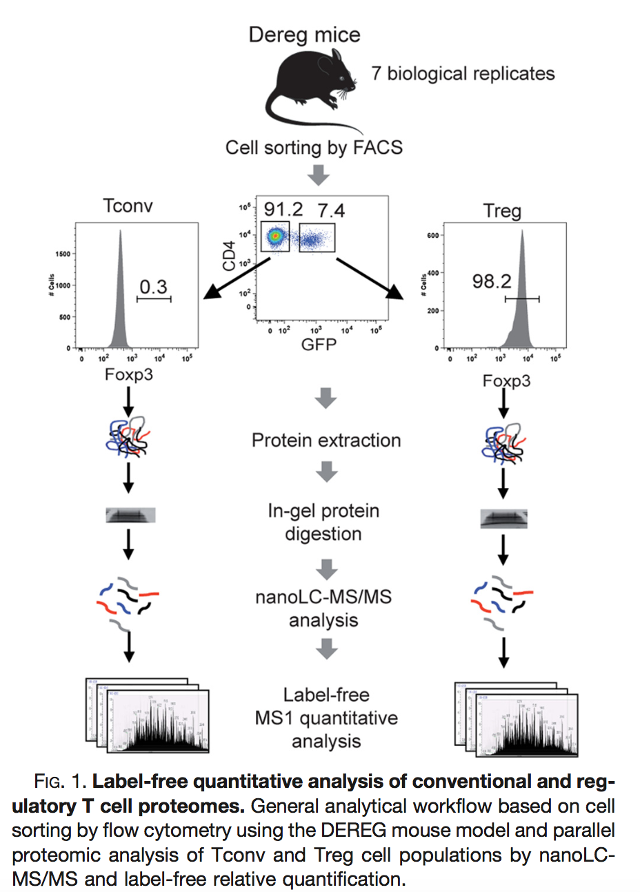

The result of a quantitative analysis is a list of peptide and/or protein abundances for every protein in different samples, or abundance ratios between the samples. In this chapter we will extend our generic workflow for differential analysis of quantitative datasets with more complex experimental designs.

We will start with assessing the impact of sample size. Then we will introduce the concept of blocking and we will continue with the analysis of a subset of the mouse diet data. 

# Breast cancer example

Eighteen Estrogen Receptor Positive Breast cancer tissues from from patients treated with tamoxifen upon recurrence have been assessed in a proteomics study. Nine patients had a good outcome (or) and the other nine had a poor outcome (pd).
The proteomes have been assessed using an LTQ-Orbitrap in data dependent acquisition (DDA) mode and the thermo output .RAW files were searched with MaxQuant (version 1.4.1.2) against the human proteome database (FASTA version 2012-09, human canonical proteome). 

The data are already processed and stored as QFeatures objects. They can be loaded in R using readRDS so you can immediately start at the data modeling. So you only have to read the data and you can start with section 5 Data exploration in the basic script. 

```{r eval=FALSE}
qf <- readRDS(url("https://github.com/statOmics/PDA-DIA/raw/refs/heads/main/data/cancer3x3.rds","rb"))
```

Three QFeatures objects are available (you can simply modify the url above replacing the filename):

1. For a 3 vs 3 comparison: cancer3x3.rds
2. For a 6 vs 6 comparison: cancer6x6.rds
3. For a 9 vs 9 comparison: cancer9x9.rds


# Blocking: Mouse T-cell example

[@DuguetEtAl2017] compared the proteomes of mouse regulatory T cells (Treg) and conventional T cells (Tconv) in order to discover differentially regulated proteins between these two cell populations. For each biological repeat the proteomes were extracted for both Treg and Tconv cell pools, which were purified by flow cytometry. The data in data/quantification/mouseTcell on the [PDA-data repository](https://github.com/statOmics/PDA25EBI/archive/refs/heads/data.zip) are a subset of the data [PXD004436](https://www.ebi.ac.uk/pride/archive/projects/PXD004436) on PRIDE.



The proteomes have been assessed using data dependent acquisition (DDA) mode. The data are already processed and stored as QFeatures objects. They can be loaded in R using readRDS so you can immediately start at the data modeling. So you only have to read the data and you can start with section 5 Data exploration in the basic script. 

```{r eval=FALSE}
qf <- readRDS(url("https://github.com/statOmics/PDA-DIA/raw/refs/heads/main/data/mouseT_CRD.rds","rb"))
```

Three QFeatures objects are available (you can simply modify the url above replacing the filename):

1. For a completely randomiced design with 4 mice for which regulatory T-cells and 4 mice for which ordinary T-cells are profiled: "mouseT_CRD.rds"
2. For a randomised complete block design with 4 mice for which both regulatory T-cells and ordinary T-cells are processed. 


# Mouse diet - Two factorial design

With the PXD059421 data deposited on ProteomeXchange researchers study the molecular effects of dietary DINCH exposure, on the proteome, phosphoproteome and acetylome profiles of visceral (VIS) and subcutaneous (SC) adipose tissue in a model of diet-induced obesity in male and female C57BL/6N mice. This study includes data on visceral and subcutaneous adipose tissue of female and male mice that were either fed a standard plant-based diet (chow), a standard high-fat diet (HFD) or two HFD diets including doses of DINCH (4,500 ppm and 15,000 ppm). Three female and three male mice were used for each diet [@AldehoffEtAl2025].

The data were downloaded from Pride and reprocessed using spectronaut. 
Here, we will focus on the proteomics data from the visceral tissue of mice subjected to the low and high DINCH diet. 

Assess the following research questions: 

- Prioritise proteins that are differentially abundant (DA) between low and high DINCH diet in female mice. 
- Prioritise proteins that are DA between low and high DINCH diet in male mice. 
- Prioritise proteins for which the effect of diet (low vs high) is different between male and female mice. 
- Prioritise proteins that are differentially abundant (DA) between low and high DINCH diet over male and female mice (useful when there is no diet x sex interaction). 


You can use this code to setup the subset of the study: 

1. Specify path to parquet file
2. Read parquet file
3. Make EG_PrecursorId from modified sequence and charge
4. Subset the data by selecting the visceral samples (VIS), and low or high diet

```{r eval = FALSE}
precursorFile = "https://github.com/statOmics/PDA-DIA/raw/refs/heads/main/data/mouseDiet-spectronaut.parquet" #1.

precursors <- arrow::read_parquet(precursorFile)  #2.

precursors <- precursors |>  #3.
  mutate(EG_PrecursorId = paste0(EG_ModifiedSequence, FG_Charge)) #3.

precursors <- precursors |> #4.
  filter(grepl("VIS", R_FileName) & #4. 
           (grepl("low",R_FileName) | grepl("high",R_FileName)) 4.
  )
```
