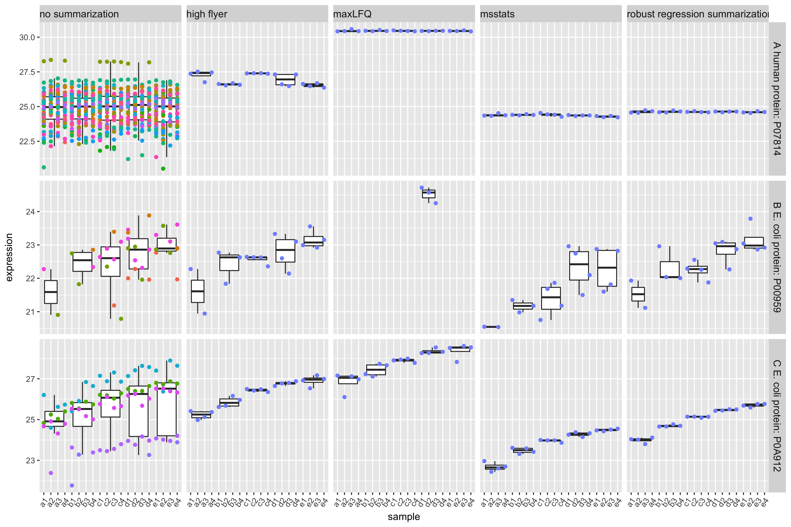

```{r, echo = FALSE}
source("R/knitr_setup.R")
```

# Background

Why proteomics? 
While genes provide the blueprint, proteins are the active functional molecules of life, driving cellular processes, signaling, structure, disease mechanisms, etc.

```{r echo=FALSE}
#| layout-ncol: 2
knitr::include_graphics(c("./figs/Dogma_Euk.png","./figs/cellProteins.png"))
```

## Conventional MS-based workflow


```{r, echo = FALSE, out.width = "60%", fig.cap = "Overview of an LFQ-based proteomics workflow."}
knitr::include_graphics("figs/lfq_workflow.png")
```
  


- Peptide Characteristics
  
  - Modifications
  - Ionisation Efficiency: huge variability
  - Identification
    - Misidentification $\rightarrow$ outliers
    - MS$^2$ selection on peptide abundance
    - Context depending missingness
    - Non-random missingness

$\rightarrow$ Unbalanced pepide identifications across samples and messy data

## Data Dependent Acquisition 


- m/z range into sequential windows (e.g., 400–425, 425–450 m/z) 
- MS2 spectra are complex as many peptides mixed
- Deconvolution of the MS2 signal 
- With dedicated software such as Spectronaut or DIA-NN
- Quantification using MS1 or MS2 peaks

## Labelled MS-based proteomics


```{r, echo = FALSE, out.width = "60%", fig.cap = "Overview of an TMT-based proteomics workflow."}
knitr::include_graphics("figs/tmt_workflow.png")
```


- MT-based workflow highly overlap with  label-free
workflows. 
- Additional sample preparation step: digested peptides from
each sample are labelled with a TMT reagent 
- Samples with different TMT reagents are pooled in a single TMT mixture
- Quantification at the MS2 level.
- TMT reagents isobaric: same peptide with different TMT labels have same
mass for intact ion at MS1. 
- TMT reporter ions released upon fragmentation during MS2 have label-specific masses. 

## Level of quantification

- MS-based proteomics returns quantification at the precursors level: pieces of proteins

```{r echo=FALSE}
knitr::include_graphics("./figs/challenges_peptides.png")
```

- Quantification commonly required on the protein level

```{r echo=FALSE}
knitr::include_graphics("./figs/challenges_proteins.png")
```

# Spike-in study (Shen et al. 2018)

```{r echo=FALSE}
knitr::include_graphics("./figs/spikeinShen.png")
```

- 4 repeats per spike-in condition
- Trypsin-digested human proteome
- After MaxQuant search with match between runs option
- Only 50% of all peptides are quantified in all samples
$\rightarrow$ **vast amount of missingness**

# MSqRob [@Goeminne2016-tr] 

```{r echo=FALSE}
knitr::include_graphics("./figs/msqrob_fit1.png")
```

$$
{\color{red}{y_{ip}}} = {\color{blue}{\mathbf{x}^t_i\boldsymbol{\beta}}} + {\color{red}{\beta_{p}^\text{pep}}} + {\color{blue}{u_i}+\color{red}{\epsilon_{ip}}}
$$

For spike-in study
$$
{\color{red}{y_{ip}}} = \sum_{g=1}^5{\color{blue}{x_{ig}\beta_g}} + {\color{red}{\beta_{p}^\text{pep}}} + {\color{blue}{u_i}}+ {\color{red}{\epsilon_{ip}}}  \text{ with } \left\{\begin{array}{c} x_{ig} = 1 \text{ if } i \in g \\x_{ig} = 0 \text{ if } i \notin g \end{array}\right.
$$

## Protein-level effects {-}

- spike-in effect: $\color{blue}{\beta_g}$
- random run effect: $\color{blue}{u_{i}^\text{run}\sim N\left(0,\sigma^2_\text{run}\right)} \rightarrow$ addresses pseudo-replication

## peptide-level {-}
- peptide specific effect  $\color{red}{\beta_{p}^\text{pep}}$
- within run error $\color{red}{\epsilon_{ip} \sim N\left(0,\sigma^2_{\epsilon}\right)}$

```{r echo=FALSE}
knitr::include_graphics("./figs/msqrob_fit4.png")
```

## Estimation 

- Robust regression for outliers
- Penalise $\boldsymbol{\beta}^\text{treat}$  
$\rightarrow$ exploit link between ridge regression and mixed models to estimate penalty: 
$$
\hat{\boldsymbol{\beta}} = \text{argmax } L(y,\boldsymbol{\beta}) - \lambda ||\boldsymbol{\beta}||^2_2 
$$
$$
\boldsymbol{\beta}^\text{treat} \sim N(0, \sigma^2_\beta) \rightarrow \lambda = \frac{\sigma^2_\epsilon}{\sigma_\beta^2}
$$

- Empirical Bayes variance estimation


## Comparisons 

- Perseus: MaxLFQ summarization \& Inference with t-test
- Proteus 
    
    - Summarization: average of 3 high-flyers
    - Inference: limma (linear model + EB)

- DEP

    - Summarization: MaxLFQ
    - Imputation at protein level: missingness at random and by low abundance
    - Inference: limma

- proDA 
  
    - Summarization: MaxLFQ
    - probabilistic dropout 
    - model: linear model + EB

- MS-stats
  
    - Summarization with peptide-based model (median polish)
    - Imputation at peptide level: missingness by low abundance
    - linear model 

Evaluation: 

$TPR =  \frac{TP}{TP + FN} = \frac{\text{\# E. coli}}{\text{\# all E. coli}}$
 
```{r echo = FALSE}
knitr::include_graphics("./figs/MSqRobVsExistingWithProDA.png")
```
<center>
$FDP = \frac{FP}{TP + FP} = \frac{\text{\# Human}}{\text{\#Human + \#E. coli}}$
</center>


$\rightarrow$ Issue: 

- difficult to disseminate 
- no protein-level summaries for plotting 
- unclear which degrees of freedom 


# msqrob2 [@Sticker2020-rl]

Allow user to choose between peptide-level models or protein-level models

Modular approach

1. Summarize peptides to proteins using robust regression
2. Robust penalized regression of protein level summaries

## Summarisation with peptide level models 

```{r echo=FALSE}
knitr::include_graphics("./figs/msqrobSum_robust1.png")
```

### Model protein by protein using peptide level model

$$
\begin{array}{ccccc}
{\color{red}{\text{peptide-level}}}&& {\color{blue}{\text{protein-level}}}\\
{\color{red}{y_{ip}}} \quad  =  \quad {\color{red}{\epsilon_{ip}}} &+& {\color{blue}{\beta_i}}\\
\end{array}
$$
```{r echo=FALSE}
knitr::include_graphics("./figs/msqrobSum_robust2.png")
```

$$
\begin{array}{ccccc}
{\color{red}{\text{peptide-level}}}&& {\color{blue}{\text{protein-level}}}\\
{\color{red}{y_{ip}}} \quad  =  \quad {\color{red}{\epsilon_{ip}}} + {\color{red}{\beta_p}} &+& {\color{blue}{\beta_i}}\\
\end{array}
$$
```{r echo=FALSE}
#| layout-ncol: 2
knitr::include_graphics(c("./figs/msqrobSum_robust3.png","./figs/msqrobSum_robust4.png"))
```


### Robust estimation using observation weights

- Outlying peptide intensities: incorrect peptide identification,
post-translational modifications, ...

```{r echo=FALSE}
#| layout-ncol: 2
knitr::include_graphics(c("./figs/msqrobSum_robust3.png","./figs/msqrobSum_robust7.png"))
```

- Solution: robust regression using huber weigths 

```{r echo=FALSE}
#| layout-ncol: 3
knitr::include_graphics(c(
  "./figs/msqrobSum_robust7.png", 
  "./figs/huberLoss3.png",
  "./figs/msqrobSum_robust8.png"))
knitr::include_graphics(c(
  "./figs/msqrobSum_robust3.png", 
  "./figs/huberLoss3.png",
  "./figs/msqrobSum_robust5.png"))
knitr::include_graphics(c(
  "./figs/msqrobSum_robust4.png", 
  "./figs/huberLoss3.png",
  "./figs/msqrobSum_robust6.png"))
```

### Comparison with other methods 

```{r}

```


## Robust summarisation & inference

$$y_i = \mathbf{x}_i^t \boldsymbol{\beta} + \epsilon_i$$

- $\boldsymbol{\beta}=[\beta_0,\beta_2^{group},\ldots,\beta_G^{group}]^t$
- $\mathbf{x}_i^t=[1\quad x_{i2}^{group} \ldots x_{iG}^{group}]$
- $x_{ig}^{group} = 1$ if sample i in group g\\  $x_{ig}^{group}=0$ otherwise

```{r}

```

${\color{red}{\text{msqrob2}}}$: robust M-estimation + ridge regression$

## Performance peptide-level msqrob2 vs protein-level msqrob2

```{r echo = FALSE}
knitr::include_graphics("./figs/MSqRobVsMSqRobSumNewColorScheme.png")
```

- Still very good performance
- 3 times faster
- df well defined
- Summaries for visualisation

## Fold change estimates 

```{r echo=FALSE}
knitr::include_graphics(c("./figs/msqrobSum_logfc.png"))
```


## Summarisation and inference are modular

```{r echo = FALSE}
knitr::include_graphics("./figs/MSqRobImprovementNewColors4.png")
```

# msqrob2hurdle: addresses missingness by modelling differential abundance and differential detection [@Goeminne2020]

$$
\left\{
\begin{array}{ccc}
z_{ip} \vert x_{ip} &\sim& B(\pi_i)\\
y_{ip} \vert z_{ip}=1, x_{ip}, u_i^{run} &\sim& N(\mu_{ip},\sigma^2)
\end{array}\right.
$$

- binary component $z_{pr}$ with detection probability $\pi_r$
$$
\begin{array}{l}
z_{pr}=0\text{: Peptide intensity is missing}\\
z_{pr}=1\text{: Peptide intensity is observed}
\end{array}
$$

- Normal component for log2-transformed intensities $y_{ip}$ for peptide $p=1,\ldots,P$ in sample $i=1,\ldots,n$

- Likelihood of the model implies an estimation ortogonality 
- Estimation and inference on $\pi_i$ via logistic regression of peptide presence absence: differential detection
- Estimation and inference on $\mu_{ip}$ via MSqRob model: differential expression given detection
- Combine inference on both components using stageR\\
\hfill\includegraphics[width=.2\textwidth]{stageR.png}

Is also possible at protein level 

$$
\begin{array}{ccc}
z_{i} \vert x_{i} &\sim& B(\pi_i, n_p)\\
\end{array}
$$
with $z_i$ the number of ions picked up for a protein in sample $i$ and $n_p$ the number of distinct ions that have been identified across all samples. 

## Performance

```{r out.width = "60%"}
knitr::include_graphics("./figs/msqrobHurdleCptacBvsA.png")
```

# msqrob2TMT [@Vandenbulcke2025-sj]


```{r, echo = FALSE, out.width = "60%", fig.cap = "Overview of an TMT-based proteomics workflow."}
knitr::include_graphics("figs/tmt_workflow.png")
```

Complex correlation structure: 
- Multiple samples in same run -> mixture 
- Mixtures often run in technical repeats
- Effects of label 

## Protein level models 

Run effects

- label-free experiments contain only a single sample per run so run-specific effects will be absorbed in the residuals. 
- In labelled experiments samples are multiplexed.
- Contemporary designs typically involve multiple MS runs
- If all treatments are present in each run, then the run effect can be estimated
using fixed effect. Indeed, for these designs run acts as a blocking variable as all treatment effects can be estimated within each run.
- For more complex designs this is no longer possible and the
uncertainty in the estimation of the mean model parameters can involve
both within and between run variability. 
- For these designs we can resort to mixed models where the run effect is modelled using
**random effects**
- they are considered as a random sample from
the population of all possible runs
- $u_{run} \sim N(0,\sigma^2_\text{run})$.

TMT-label: 
  - impurities during production may lead to unreproducible effects. 
  - random effect to account for labelling effects: $u^\text{label}_l \sim N(0, \sigma^{2,\text{label}})$.

Sometimes the same sample mix is run multiple times on the MS, technical replication
- $u_m^\text{mix} \sim N(0,\sigma^2_\text{mix})$

$$
y_{rlm} =
\mathbf{x}^T_{rlm} \boldsymbol{\beta} +
u_r^\text{run} + u_l^\text{label} + u_m^\text{mix} + \epsilon_{rlm}
$$
with $y_{rlm}$ protein level intensities for the sample labelled with label $l$ of mix $m$ quantified in run $r$ and $u_r, u_l, u_m$ random effects that model the hierarchical correlation structure. 

## Ion-level models 

Ion-level data induce additional levels of correlation. 
- Spectrum level: Intensities for the different reporter ions in a TMT run within the same spectrum (PSM)
will be more similar than the intensities between PSMs. 
in each label of a run multiple i.e. 
- $u^\text{PSM}_{rp} \sim
N(0,\sigma^{2,\text{PSM}})

- Protein level: Multiple ions are picked up for each protein. Hence, intensities
from different PSMs for a protein in the same label of a run will be
more alike than intensities of different PSMs for the same protein
between labels of runs, and we will address this correlation with a
label-specific random effect nested in run, 
- $u_{rl}^{label} \sim N(0,\sigma^{2,\text{label}})$.

$$
y_{rlm} =
\mathbf{x}^T_{rlm} \boldsymbol{\beta} +
u_r^\text{run} + u_l^\text{label} + u_m^\text{mix} + \epsilon_{rlm}
$$
```{r, echo = FALSE,}
knitr::include_graphics("figs/msqrob2tmt-spikein.png")
```

# msqrob2PTM 

- Post-translational modifications (PTMs) are chemical changes made to a protein after it has been synthesized.
- These modifications alter the protein’s activity, stability, localization, or interactions with other molecules.
- More importantly, these PTMs often act as key switches in many cellular pathways that play vital roles in e.g. cell proliferation, metastasis and ageing.
- We can readily adopt differential abundance of PTMs using msqrob2 at the peptide or precursor level, i.e. peptidoform differential abundance.
- However, the differential abundant PTMs can be due 
- We therefore ported the concept of differential usage towards the PTM context, i.e. usage is defined as the relative fold change of the PTM corrected for the fold change at the protein level: 
$$\log_2 DU = \log_2 FC^\text{PTM} - log_2 FC^\text{protein}$$

Depending on the design of the experiment, e.g. can the PTM and protein level quantification be done on the same sampled, paired design or only on independent samples we propose different workflows. 

- Paired samples 

    1. Perform regular data processing at the protein-level: log2-transformation, normalisation and summarisation
    2. Calculate relative log2 transformed abundances at peptidoform level 
    $$ y^\text{pep,rel}_i = y^\text{pep}_i - y^\text{prot}_i
    3. Perform a conventional differential msqrob2 analysis on the relative peptidoform level. This immediately gives us 
    4. Optionally 
    
        a. aggregate relative log2 transformed abundances at peptidoform level at PTM-level
        b. perform a differential msqrob2 analysis at PTM-level

- Unpaired PTM-level and protein samples (Default MSstatsTMT approach also used for paired designs)

  1. Perform regular msqrob2 differential analysis at the protein-level
  2. Perform regular msqrob2 differential analysis at the peptidoform (PTM-level)
  3. Calculate usages
  
$$ 
\begin{array}{ccc}
\log_2 \widehat{DU} & =& \log_2 \widehat{FC}^\text{PTM} - log_2 \widehat{FC}^\text{protein}\\
SE_\widehat{DU} &=& \sqrt{(SE_\widehat{FC}^{PTM})^2 + (SE_\widehat{FC}^{protein})^2}
\end{array}
$$

# Case study


# References