```{r, echo = FALSE}
source("R/knitr_setup.R")
```

```{r, echo = FALSE, out.width = "20%", fig.cap = ""}

```

# Background

## msqrob2-team

Current and former PhD students and postdocs

- Ludger Goeminne
- Adriaan Sticker
- Nina Demeulemeester
- Stijn Vandenbulcke
- Alexandre Seghers
- Christophe Vanderaa (postdoc)
- Lucas Beerlandt
- Luca De Corso

UGent-VIB PI's

- Kris Gevaert (wet-lab)
- Lennart Martens (proteomics informatics)

University of Padua

- Davide Risso (PI - Statistical Genomics)
- Cristian Castiglione (postdoc)


## Christian de Duve (1917 - 2013)

- Belgian Nobel price winner 
- Pioneer in biochemistry and biotechnology
- Amazing definition of life: 

1. Life is one 
2. Life is chemistry 
3. Life is information

## Why proteomics? 

While genes provide the blueprint, 
proteins are the active functional molecules of life, 

 - driving cellular processes, 
 - signaling, 
 - structure, 
 - disease mechanisms, 
 - etc.

```{r echo=FALSE}
#| layout-ncol: 2
knitr::include_graphics(c("./figs/Dogma_Euk.png","./figs/cellProteins.png"))
```


## Conventional MS-based workflow


```{r, echo = FALSE, out.width = "60%", fig.cap = "Overview of an LFQ-based proteomics workflow."}
knitr::include_graphics("figs/lfq_workflow.png")
```
  


- Peptide Characteristics
  
  - Modifications
  - Ionisation Efficiency: huge variability
  - Identification
    - Misidentification $\rightarrow$ outliers
    - MS$^2$ selection on peptide abundance
    - Context depending missingness
    - Non-random missingness

$\rightarrow$ Unbalanced pepide identifications across samples and messy data

## Level of quantification

- MS-based proteomics returns quantification at the precursors level: pieces of proteins

```{r echo=FALSE}
knitr::include_graphics("./figs/challenges_peptides.png")
```

- Quantification commonly required on the protein level

```{r echo=FALSE}
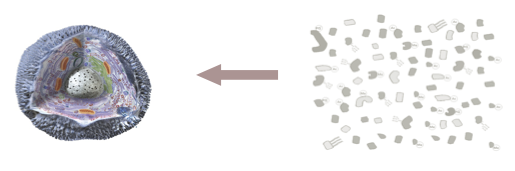
```

# Spike-in study (Shen et al. 2018)

```{r echo=FALSE}
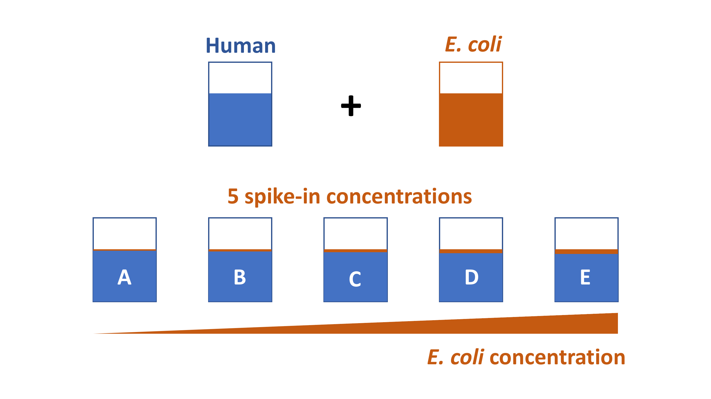
```

- 4 repeats per spike-in condition
- Trypsin-digested human proteome
- After MaxQuant search with match between runs option
- Only 50% of all peptides are quantified in all samples
$\rightarrow$ **vast amount of missingness**

# Pre-processing

- Filtering
- log-transformation

```{r echo=FALSE}
#| layout-ncol: 2
knitr::include_graphics(c("./figs/ups-spikein.png","./figs/ups-spikein-log.png"))
```

- normalisation

```{r echo=FALSE}
#| layout-ncol: 2
knitr::include_graphics(c("./figs/shen-spikein-log-nonorm.png","./figs/shen-spikein-norm.png"))
```

# MSqRob [@Goeminne2016-tr] 

```{r echo=FALSE}
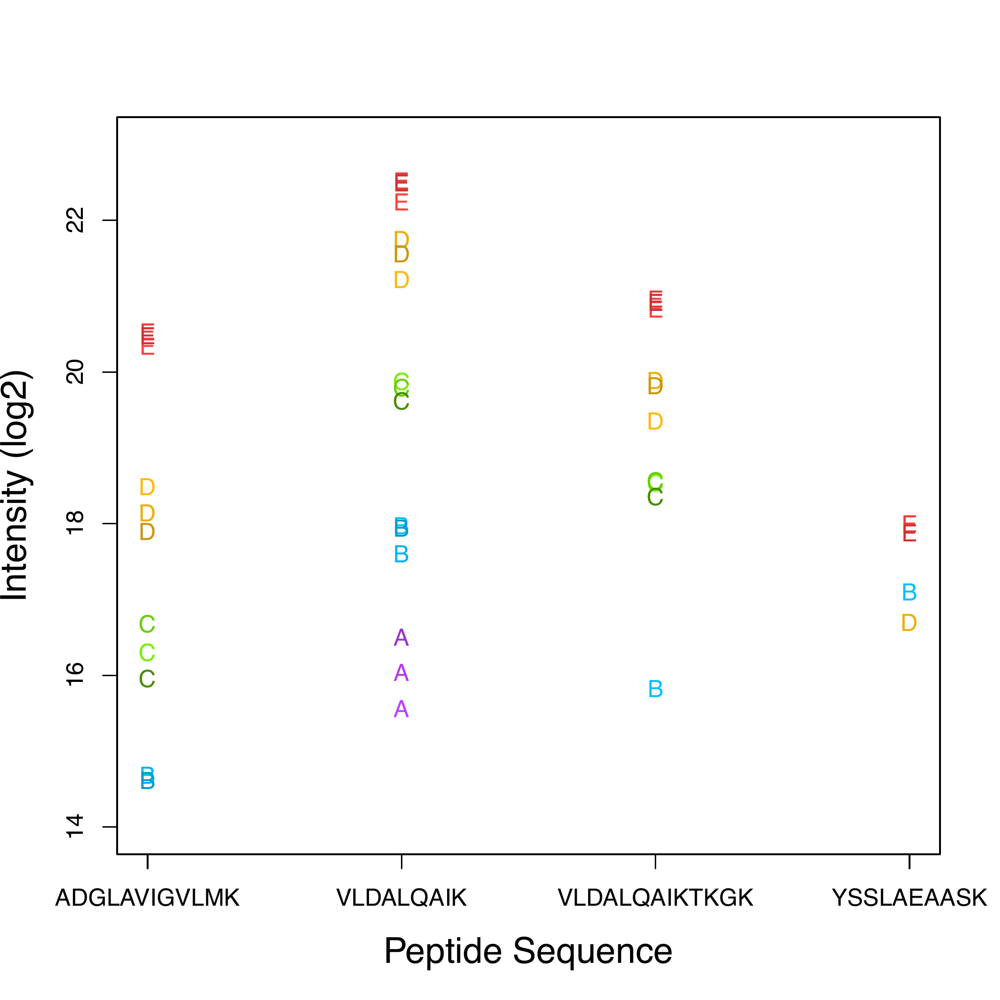
```

$$
{\color{red}{y_{ip}}} = {\color{blue}{\mathbf{x}^t_i\boldsymbol{\beta}}} + {\color{red}{\beta_{p}^\text{pep}}} + {\color{blue}{u_i}+\color{red}{\epsilon_{ip}}}
$$

For spike-in study
$$
{\color{red}{y_{ip}}} = \sum_{g=1}^5{\color{blue}{x_{ig}\beta_g}} + {\color{red}{\beta_{p}^\text{pep}}} + {\color{blue}{u_i}}+ {\color{red}{\epsilon_{ip}}}  \text{ with } \left\{\begin{array}{c} x_{ig} = 1 \text{ if } i \in g \\x_{ig} = 0 \text{ if } i \notin g \end{array}\right.
$$

## Protein-level effects {-}

- spike-in effect: $\color{blue}{\beta_g}$
- random run effect: $\color{blue}{u_{i}^\text{run}\sim N\left(0,\sigma^2_\text{run}\right)} \rightarrow$ addresses pseudo-replication

## peptide-level {-}
- peptide specific effect  $\color{red}{\beta_{p}^\text{pep}}$
- within run error $\color{red}{\epsilon_{ip} \sim N\left(0,\sigma^2_{\epsilon}\right)}$

```{r echo=FALSE}
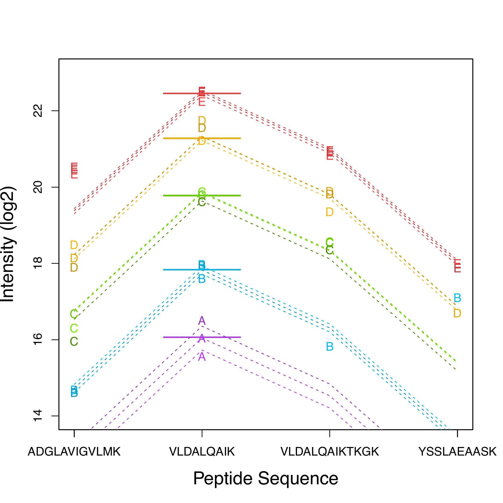
```

## Estimation 

- Robust regression for outliers (see later)
- Penalise $\boldsymbol{\beta}^\text{treat}$  
$\rightarrow$ exploit link between ridge regression and mixed models to estimate penalty: 
$$
\hat{\boldsymbol{\beta}} = \text{argmax } L(y,\boldsymbol{\beta}) - \lambda ||\boldsymbol{\beta}||^2_2 
$$
$$
\boldsymbol{\beta}^\text{treat} \sim N(0, \sigma^2_\beta) \rightarrow \lambda = \frac{\sigma^2_\epsilon}{\sigma_\beta^2}
$$

- Empirical Bayes variance estimation


## Comparisons 

- Perseus: MaxLFQ summarization \& Inference with t-test
- Proteus 
    
    - Summarization: average of 3 high-flyers
    - Inference: limma (linear model + EB)

- DEP

    - Summarization: MaxLFQ
    - Imputation at protein level: missingness at random and by low abundance
    - Inference: limma

- proDA 
  
    - Summarization: MaxLFQ
    - probabilistic dropout 
    - model: linear model + EB

- MS-stats
  
    - Summarization with peptide-based model (median polish)
    - Imputation at peptide level: missingness by low abundance
    - linear model 

Evaluation: 

$TPR =  \frac{TP}{TP + FN} = \frac{\text{\# E. coli}}{\text{\# all E. coli}}$
 
```{r echo = FALSE}
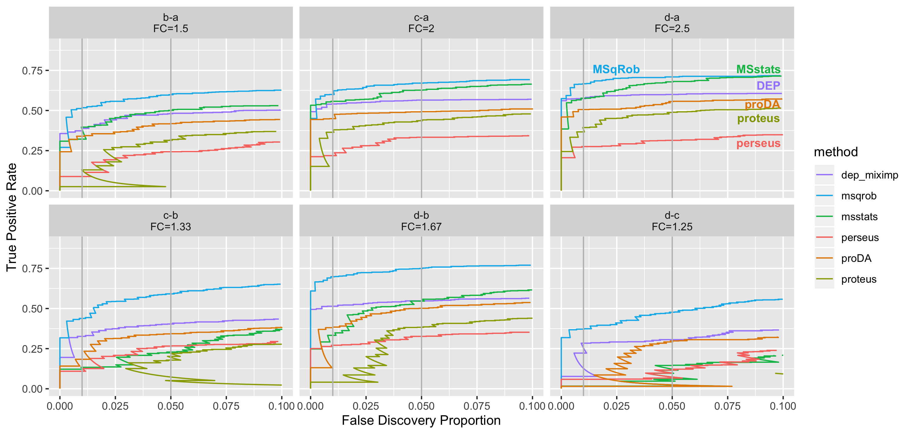
```
<center>
$FDP = \frac{FP}{TP + FP} = \frac{\text{\# Human}}{\text{\#Human + \#E. coli}}$
</center>


$\rightarrow$ Issue: 

- difficult to disseminate 
- no protein-level summaries for plotting 
- unclear which degrees of freedom 


# msqrob2 [@Sticker2020-rl]

Allow user to choose between peptide-level models or protein-level models

Modular approach

1. Summarize peptides to proteins using robust regression
2. Robust penalized regression of protein level summaries

## Summarisation with peptide level models 

```{r echo=FALSE}
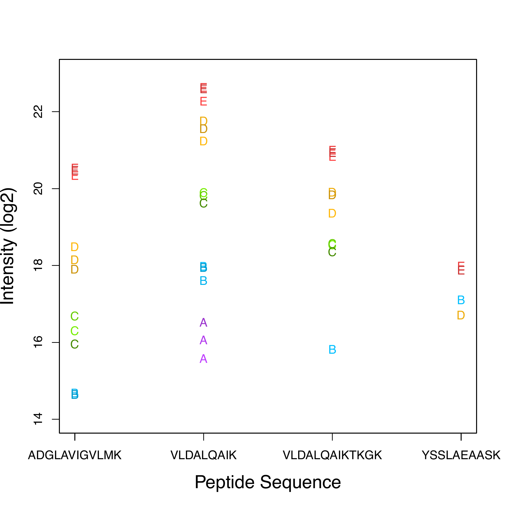
```

### Model protein by protein using peptide level model

$$
\begin{array}{ccccc}
{\color{red}{\text{peptide-level}}}&& {\color{blue}{\text{protein-level}}}\\
{\color{red}{y_{ip}}} \quad  =  \quad {\color{red}{\epsilon_{ip}}} &+& {\color{blue}{\beta_i}}\\
\end{array}
$$
```{r echo=FALSE}
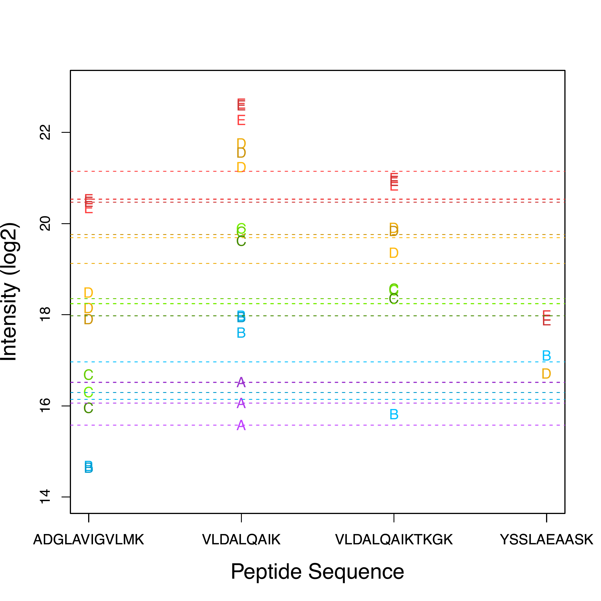
```

$$
\begin{array}{ccccc}
{\color{red}{\text{peptide-level}}}&& {\color{blue}{\text{protein-level}}}\\
{\color{red}{y_{ip}}} \quad  =  \quad {\color{red}{\epsilon_{ip}}} + {\color{red}{\beta_p}} &+& {\color{blue}{\beta_i}}\\
\end{array}
$$
```{r echo=FALSE}
#| layout-ncol: 2
knitr::include_graphics(c("./figs/msqrobSum_robust3.png","./figs/msqrobSum_robust4.png"))
```


### Robust estimation using observation weights

- Outlying peptide intensities: incorrect peptide identification,
post-translational modifications, ...

```{r echo=FALSE}
#| layout-ncol: 2
knitr::include_graphics(c("./figs/msqrobSum_robust3.png","./figs/msqrobSum_robust7.png"))
```

- Solution: robust regression using huber weigths 

```{r echo=FALSE}
#| layout-ncol: 3
knitr::include_graphics(c(
  "./figs/msqrobSum_robust7.png", 
  "./figs/huberLoss3.png",
  "./figs/msqrobSum_robust8.png"))
knitr::include_graphics(c(
  "./figs/msqrobSum_robust3.png", 
  "./figs/huberLoss3.png",
  "./figs/msqrobSum_robust5.png"))
knitr::include_graphics(c(
  "./figs/msqrobSum_robust4.png", 
  "./figs/huberLoss3.png",
  "./figs/msqrobSum_robust6.png"))
```


## Robust summarisation & inference

$$y_i = \mathbf{x}_i^t \boldsymbol{\beta} + \epsilon_i$$

- $\boldsymbol{\beta}=[\beta_0,\beta_2^{group},\ldots,\beta_G^{group}]^t$
- $\mathbf{x}_i^t=[1\quad x_{i2}^{group} \ldots x_{iG}^{group}]$
- $x_{ig}^{group} = 1$ if sample i in group g\\  $x_{ig}^{group}=0$ otherwise

```{r}
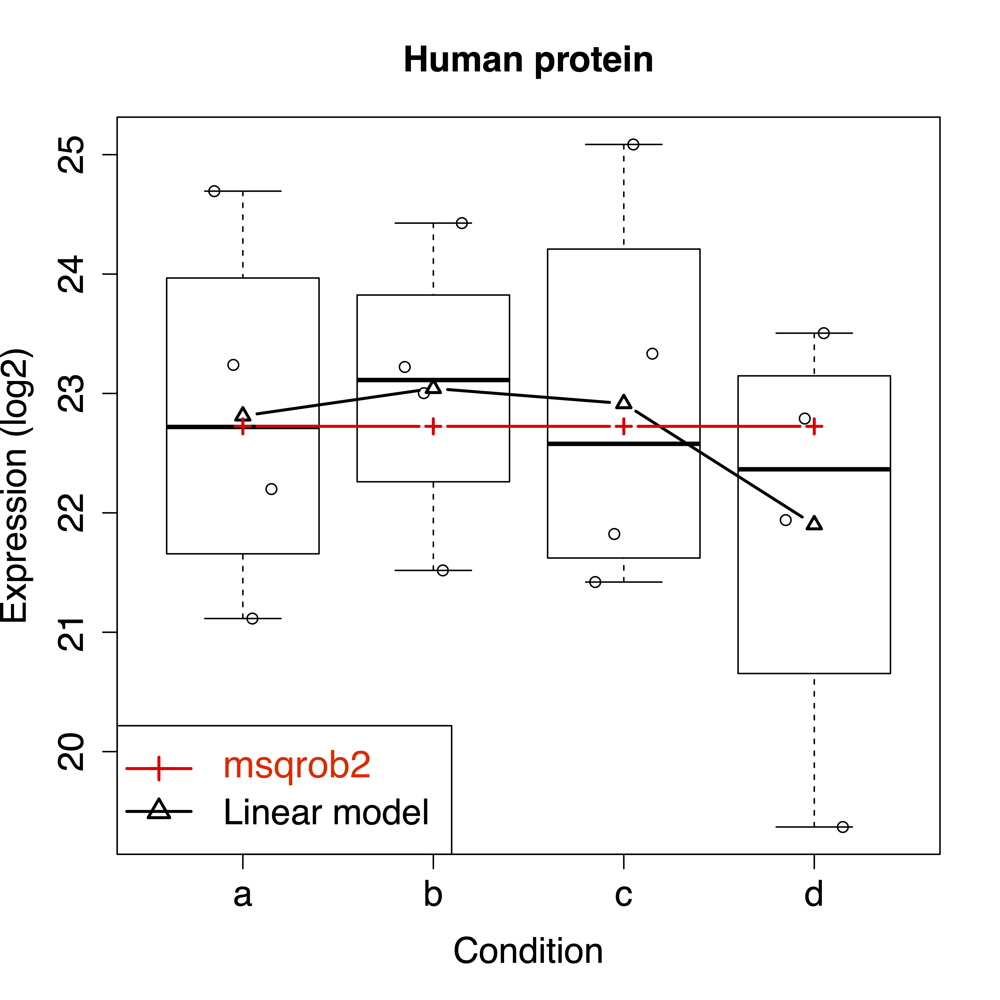
```

${\color{red}{\text{msqrob2}}}$: robust M-estimation + ridge regression

## Performance peptide-level msqrob2 vs protein-level msqrob2

```{r echo = FALSE}
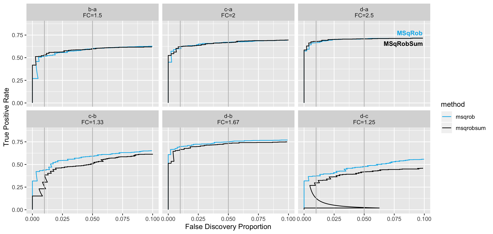
```

- Still very good performance
- 3 times faster
- df well defined
- Summaries for visualisation

## Fold change estimates 

```{r echo=FALSE}
knitr::include_graphics(c("./figs/msqrobSum_logfc.png"))
```


## Summarisation and inference are modular

```{r echo = FALSE}
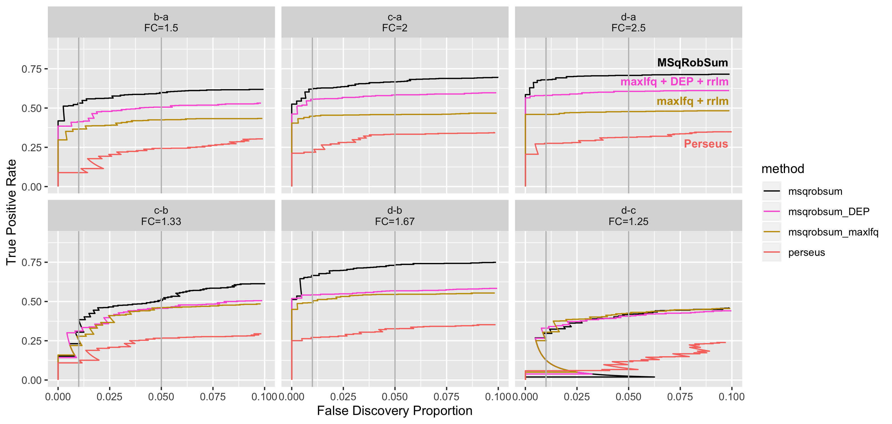
```

# msqrob2hurdle: addresses missingness by modelling differential abundance and differential detection [@Goeminne2020]

$$
\left\{
\begin{array}{ccc}
z_{ip} \vert x_{ip} &\sim& B(\pi_i)\\
y_{ip} \vert z_{ip}=1, x_{ip}, u_i^{run} &\sim& N(\mu_{ip},\sigma^2)
\end{array}\right.
$$

- binary component $z_{pr}$ with detection probability $\pi_r$
$$
\begin{array}{l}
z_{pr}=0\text{: Peptide intensity is missing}\\
z_{pr}=1\text{: Peptide intensity is observed}
\end{array}
$$

- Normal component for log2-transformed intensities $y_{ip}$ for peptide $p=1,\ldots,P$ in sample $i=1,\ldots,n$

- Likelihood of the model implies an estimation ortogonality 
- Estimation and inference on $\pi_i$ via logistic regression of peptide presence absence: differential detection
- Estimation and inference on $\mu_{ip}$ via MSqRob model: differential expression given detection
- Combine inference on both components using stageR\\
\hfill\includegraphics[width=.2\textwidth]{stageR.png}

Is also possible at protein level 

$$
\begin{array}{ccc}
z_{i} \vert x_{i} &\sim& B(\pi_i, n_p)\\
\end{array}
$$
with $z_i$ the number of ions picked up for a protein in sample $i$ and $n_p$ the number of distinct ions that have been identified across all samples. 

## Performance

```{r out.width = "60%"}
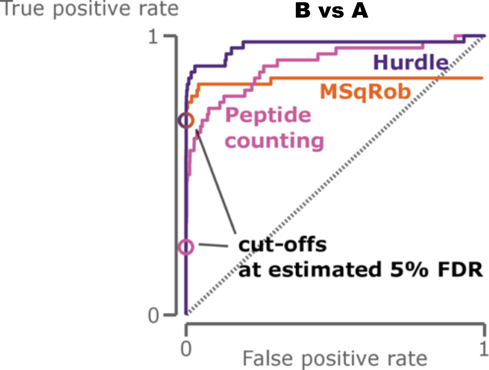
```

# msqrob2TMT [@Vandenbulcke2025-sj]


```{r, echo = FALSE, out.width = "60%", fig.cap = "Overview of an TMT-based proteomics workflow."}
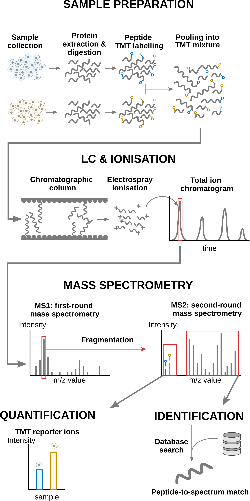
```

Complex correlation structure: 

- Multiple samples in same run -> mixture 
- Mixtures often run in technical repeats
- Effects of label 

## Protein level models 

**Run effects**

- Contemporary labelled designs typically involve multiple MS runs
- Block on run effect: possible if all treatments are present in each run
- For more complex designs no longer possible 

$\rightarrow$ comparisons involve within and between run variability 

$\rightarrow$  resort to mixed models where run effect is modelled using
**random effects**

- runs considered as a random sample from the population of all possible runs
- $u_{run} \sim N(0,\sigma^2_\text{run})$.

**TMT-label** 

  - impurities during production may lead to unreproducible effects. 
  - random effect to account for labelling effects: $u^\text{label}_l \sim N(0, \sigma^{2,\text{label}})$.

**Technical repeats**

Sometimes same sample mix multiple times on the MS 

$\rightarrow$ technical replication

$\rightarrow u_m^\text{mix} \sim N(0,\sigma^2_\text{mix})$

$$
y_{rlm} =
\mathbf{x}^T_{rlm} \boldsymbol{\beta} +
u_r^\text{run} + u_l^\text{label} + u_m^\text{mix} + \epsilon_{rlm}
$$
with 

- $y_{rlm}$: protein level intensities for sample labelled with label $l$ of mix $m$ quantified in run $r$ 
- $u_r, u_l, u_m$ random effects that model hierarchical correlation structure. 

## Ion-level models 

Ion-level data induce additional levels of correlation.

**Spectrum level**

- Spectrum level: Intensities for different reporter ions in a TMT run within the same spectrum (PSM) will be more similar than the intensities between PSMs. 
- $u^\text{PSM}_{rp} \sim
N(0,\sigma^{2,\text{PSM}})

**Protein level**

- Multiple ions are picked up for each protein
- address correlation with label-specific random effect nested in run, 
- $u_{rl}^{label} \sim N(0,\sigma^{2,\text{label}})$.

$$
y_{rlmp} =
\mathbf{x}^T_{rlm} \boldsymbol{\beta} +
u_r^\text{run} + u_l^\text{label} + u_m^\text{mix} + u_{rl}^\text{label} + u_{rp}^\text{PSM} + \epsilon_{rlm}
$$
```{r, echo = FALSE,}
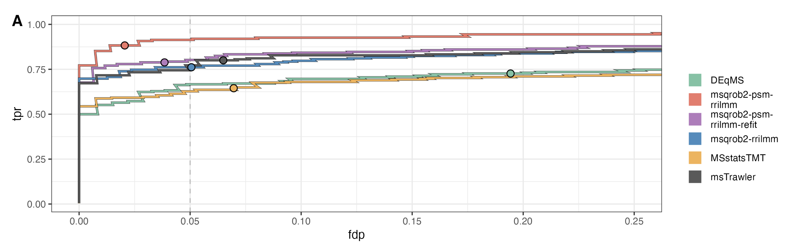
```

# msqrob2PTM [DemeulemeesterEtAl2024], [@VanLeeneEtal2026]

- Post-translational modifications (PTMs): chemical changes made to protein after synthesis.
- Modifications alter protein’s activity, stability, localization, or interactions with other molecules.
- act as key switches in many cellular pathways 
- Play vital roles in e.g. cell proliferation, metastasis and ageing.

- Differential abundance of PTMs using msqrob2 at the peptide or precursor level, i.e. peptidoform differential abundance.

```{r, echo = FALSE,}
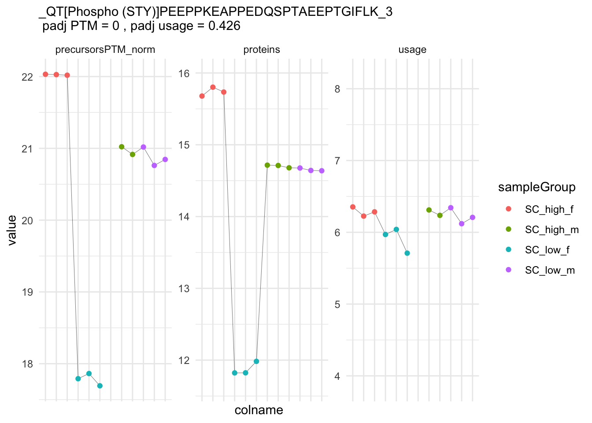
```

- Differential abundant PTMs can be due protein abundance

- Port concept of differential usage towards PTMs: 

$$\log_2 DU = \log_2 FC^\text{PTM} - log_2 FC^\text{protein}$$

Two designs: PTM and protein level quantification be done 

- on same sample: paired design 
- using independent samples


Paired samples 

1. Perform regular data processing at the protein-level: 
  
    - log2-transformation, 
    - normalisation and 
    - summarisation

2. Calculate relative log2 transformed abundances at peptidoform level 
$$y^\text{pep,rel}_i = y^\text{pep}_i - y^\text{prot}_i$$
3. Perform conventional differential msqrob2 analysis on the relative peptidoform level. $\rightarrow$ Immediately gives us diferential usages!
    
4. Optionally 
    
  a. aggregate relative log2 transformed abundances at peptidoform level at PTM-level
  b. perform a differential msqrob2 analysis at PTM-level


Unpaired PTM-level and protein samples (Default MSstatsTMT approach also used for paired designs)

  1. Perform regular msqrob2 differential analysis at the protein-level
  2. Perform regular msqrob2 differential analysis at the peptidoform (PTM-level)
  3. Calculate usages
  
$$ 
\begin{array}{ccc}
\log_2 \widehat{DU} & =& \log_2 \widehat{FC}^\text{PTM} - log_2 \widehat{FC}^\text{protein}\\
SE_\widehat{DU} &=& \sqrt{(SE_\widehat{FC}^{PTM})^2 + (SE_\widehat{FC}^{protein})^2}
\end{array}
$$

# DIA-mouse study 

## Data independent acquisition 


- m/z range into sequential windows (e.g., 400–425, 425–450 m/z) 
- MS2 spectra are complex as many peptides mixed
- Deconvolution of the MS2 signal 
- With dedicated software such as Spectronaut or DIA-NN

    - Identification based on spectral libraries
    - Library free: FASTA database to predict in silico spectra, retention times, and ion mobilities, which are then used to search the DIA data
    - Use of decoys sequences to estimate false discovery rate of ID 
    
- Quantification using MS2 and/or MS1 peaks

## Study design 

Molecular effects of dietary DINCH exposure? 

- on proteome, phosphoproteome and acetylome profiles of 
- visceral (VIS) and subcutaneous (SC) adipose tissue in 
- male and female C57BL/6N mice. 
- 3 male and 3 female mice fed with

```{r echo=FALSE}
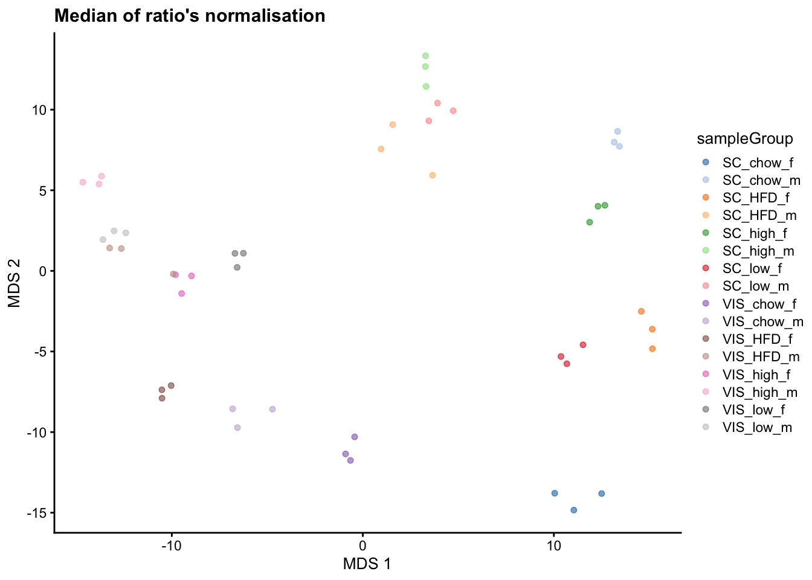
```

4 diets: 

- standard plant-based diet (chow), 
- a standard high-fat diet (HFD) 
- HFD with low dosis of DINCH 
- HFD with high dosis of DINCH

3 Factors: 
- Diet
- sex
- tissue 

Repeated measures: 
- VIS and SC


## Model 

~ sex * diet * tissue + (1|mouse)

- Possible in msqrob2! 
- Not in other software. 

- Due to technical issues we only look at specific subset. 

```{r echo=FALSE}
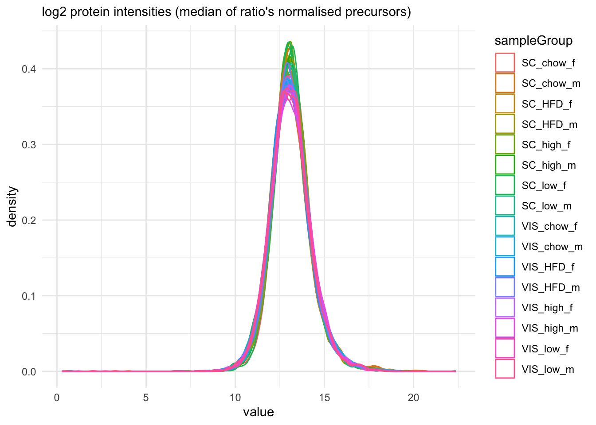
```

[case](./mouse-diet-two-factors-PTM-SC.html)


# [OmicsGMF](./figs/eurobioc2026_Clement.pdf) 
# References